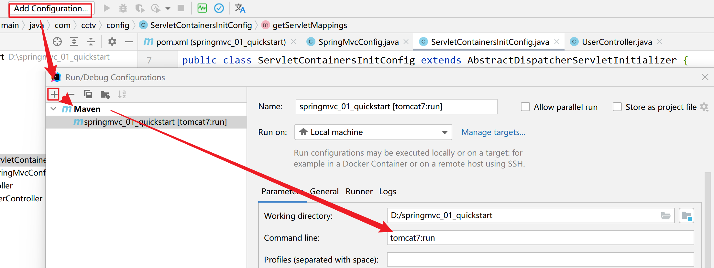
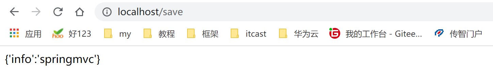
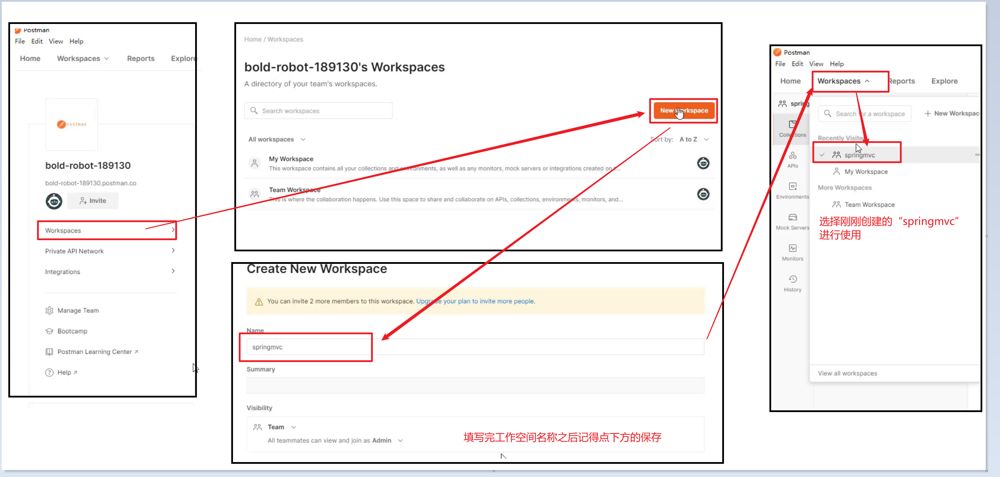
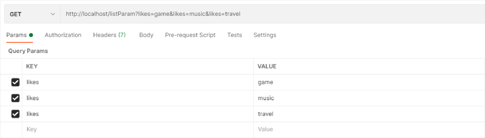
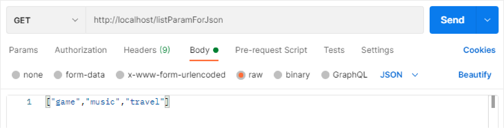
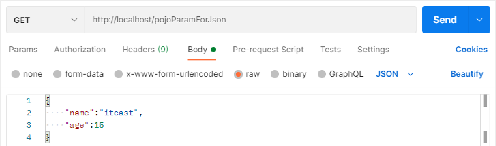
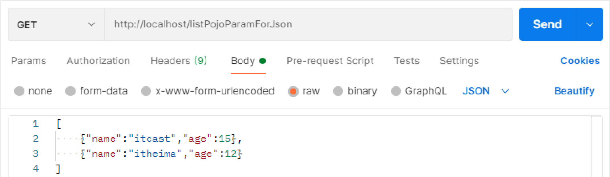
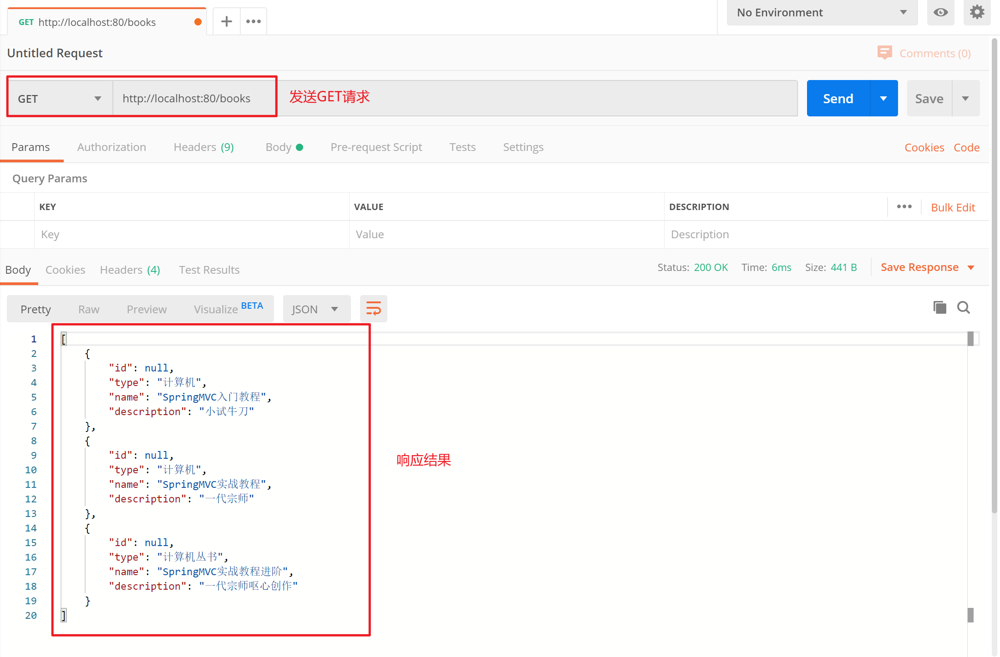

## 今日目标

- [ ] 能够知道 SpringMVC 的优点
- [ ] 能够编写 SpringMVC 入门案例
- [ ] 能够使用 PostMan 发送请求
- [ ] 能够掌握普通类型参数传递
- [ ] 能够掌握 POJO 类型参数传递
- [ ] 能够掌握 json 数据参数传递
- [ ] 能够掌握响应 json 数据
- [ ] 能够掌握 rest 风格快速开发
- [ ] 能够完成基于 restful 页面数据交互案例

## 一、SpringMVC 简介

### 1 SpringMVC 概述

springmvc 是一个 web 层框架，在前后端分离开发中承担 controller 控制器的制作以及将数据转成 json 格式返回给前端页面

#### 问题导入

SpringMVC 框架有什么优点？

#### SpringMVC 概述

1. SpringMVC 是一种基于 Java 实现 MVC 模型的轻量级 Web 框架
2. 优点
   1. 使用简单，开发便捷（相比于 Servlet）
   2. 灵活性强


### 2 入门案例【重点】

#### 2.1 问题导入

在 Controller 中如何定义访问路径，如何响应数据？


#### 2.1 实现步骤

```text
1 创建web工程（Maven结构）
2 设置maven-tomcat服务器，加载web工程(tomcat插件）
3 导入坐标（SpringMVC+Servlet）
4 定义处理请求的功能类（UserController）
5 编写SpringMVC配置类，加载处理请求的Bean。
6 加载SpringMVC配置，并设置SpringMVC请求拦截的路径
```

#### 2.2 代码实现

##### 【第一步】创建 web 工程（Maven 结构）

##### 【第二步】设置 tomcat 服务器，加载 web 工程(tomcat 插件）

```xml 
<build>
    <plugins>
      <plugin>
        <groupId>org.apache.tomcat.maven</groupId>
        <artifactId>tomcat7-maven-plugin</artifactId>
        <version>2.1</version>
        <configuration>
          <port>80</port><!--tomcat端口号-->
          <path>/</path> <!--虚拟目录-->
          <uriEncoding>UTF-8</uriEncoding><!--访问路径编解码字符集，解决get请求中文乱码-->
        </configuration>
      </plugin>
    </plugins>
  </build>
```

##### 【第三步】导入坐标（SpringMVC+Servlet）

```xml
<dependencies>
    <dependency>
        <groupId>javax.servlet</groupId>
        <artifactId>javax.servlet-api</artifactId>
        <version>3.1.0</version>
        <scope>provided</scope>
    </dependency>
    <dependency>
        <groupId>org.springframework</groupId>
        <artifactId>spring-webmvc</artifactId>
        <version>5.2.10.RELEASE</version>
    </dependency>
</dependencies>
```

**注意事项：**

1. 课程版本基于 Spring 主版本 5.2.10.RELEASE 制作
2. 导入 spring-webmvc 坐标自动依赖 spring 相关坐标

##### 【第四步】定义处理请求的功能类（UserController）

```java
//定义表现层控制器bean
@Controller
public class UserController {
    //设置映射路径为/save，即外部访问路径
    @RequestMapping("/save")
    //设置当前操作返回结果为指定json数据（本质上是一个字符串信息） 告诉页面该return的就是响应体不是页面，不加就404
    @ResponseBody
    public String save(){
        System.out.println("user save ...");
        return "{'info':'springmvc'}";
    }
}

简化：
@RestController //Controller+ResponseBody 
    /*Controller设定SpringMVC的核心控制器bean
    ResponseBody设置当前控制器方法响应内容为当前返回值，无需解析*/
@RequestMapping("/books")
public class BookController {

    @Autowired
    private BookService bookService;

    //添加
    @PostMapping
    public Result save(@RequestBody Book book) { //RequestBody 页面json数据转换
    }

    //修改
    @PutMapping
    public Result update(@RequestBody Book book) {
    }

    //删除
    @DeleteMapping("/{id}")
    public Result delete(@PathVariable Integer id) {
    }

    //查询
    @GetMapping("/{id}")
    public Result getById(@PathVariable Integer id) {
    }
}

```

注意事项：
对于 SpringMVC 而言，Controller 方法返回值默认表示要跳转的页面，没有对应的页面就会报错。如果不想跳转页面而是响应数据，那么就需要在方法上使用@ResponseBody 注解。

##### 【第五步】编写 SpringMVC 配置类，加载处理请求的 Bean

```java
//springmvc配置类，本质上还是一个spring配置类
@Configuration
@ComponentScan("com.itheima.controller")
public class SpringMvcConfig {
}
```

##### 【第六步】加载 SpringMVC 配置，并设置 SpringMVC 请求拦截的路径（web3.0 规范 web.xml 不需要了，改成配置使类形式替代它；启动服务器得把配置加载上）

```java
//web容器配置类  （servlet容器初始化的配置类）
public class ServletContainersInitConfig extends AbstractDispatcherServletInitializer {
    //加载springmvc配置类，产生springmvc容器（本质还是spring容器）
    protected WebApplicationContext createServletApplicationContext() {
        //初始化WebApplicationContext对象
        AnnotationConfigWebApplicationContext ctx = new AnnotationConfigWebApplicationContext();
        //加载指定配置类
        ctx.register(SpringMvcConfig.class);
        return ctx;
    }


    //设置由springmvc控制器处理的请求映射路径
    protected String[] getServletMappings() {
        return new String[]{"/"}; // 斜杠表示所有请求都归springmvc处理
    }

    //加载spring配置类，产生spring容器，该示例目前使用不到spring（严谨点就是非springmvc之外的）
    protected WebApplicationContext createRootApplicationContext() {
        return null;
    }
}


其他写法：
    public class ServletConfig extends AbstractAnnotationConfigDispatcherServletInitializer {
        //spring核心配置
        protected Class<?>[] getRootConfigClasses() {
            return new Class[]{SpringConfig.class};
        }

        //springmvc核心配置，用于web请求处理
        protected Class<?>[] getServletConfigClasses() {
            return new Class[]{SpringMvcConfig.class};
        }
        /*springmvc可以访问spring的容器对象，spring容器对象不能访问springmvc 父子容器
    不想有这种区别，可以把spring的配置写到springmvc这边，spring留空，{SpringMvcConfig.class,SpringConfig.class}
    * */

        //拦截所有请求
        protected String[] getServletMappings() {
            return new String[]{"/"};
        }

        //post请求中文乱码处理
        @Override
        protected Filter[] getServletFilters() {
            CharacterEncodingFilter filter = new CharacterEncodingFilter();
            filter.setEncoding("UTF-8");
            return new Filter[]{filter}; //多个过滤器使用逗号隔开  filter1,filter2
        }
    }

```


使用 pom.xml maven 内置 tomcat 服务器并配置运行命令按钮方便测试




#### 2.3 运行结果



#### 2.4 案例注解和类解析

##### 2.4.1 @Controller 注解

- 名称：@Controller
- 类型：类注解
- 位置：SpringMVC 控制器类定义上方
- 作用：设定 SpringMVC 的核心控制器 bean
- 范例

```java
@Controller
public class UserController {
}
```

##### 2.4.2 @RequestMapping 注解

- 名称：@RequestMapping
- 类型：方法注解
- 位置：SpringMVC 控制器方法定义上方
- 作用：设置当前控制器方法请求访问路径
- 范例

```java
@RequestMapping("/save")
public void save(){
    System.out.println("user save ...");
}
```

> 注意：其实@RequestMapping 注解还可以写到类上面，笔记后面会介绍到。

##### 2.4.3 @ResponseBody 注解

- 名称：@ResponseBody
- 类型：方法注解
- 位置：SpringMVC 控制器方法定义上方
- 作用：设置当前控制器方法响应内容为当前返回值，无需解析
- 范例

```java
@RequestMapping("/save")
@ResponseBody
public String save(){
    System.out.println("user save ...");
    return "{'info':'springmvc'}";
}
```

##### 2.4.4 AbstractDispatcherServletInitializer 类

- AbstractDispatcherServletInitializer 类是 SpringMVC 提供的快速初始化 Web3.0 容器的抽象类

- AbstractDispatcherServletInitializer 提供三个接口方法供用户实现

  - createServletApplicationContext()方法，创建 Servlet 容器时，加载 SpringMVC 对应的 bean 并放入 WebApplicationContext 对象范围中，而 WebApplicationContext 的作用范围为 ServletContext 范围，即整个 web 容器范围。

  ```java
  //加载springmvc配置类，产生springmvc容器（本质还是spring容器）
  protected WebApplicationContext createServletApplicationContext() {
      AnnotationConfigWebApplicationContext ctx = new AnnotationConfigWebApplicationContext();
      ctx.register(SpringMvcConfig.class);
      return ctx;
  }
  ```

  - getServletMappings()方法，设定 SpringMVC 对应的请求映射路径，设置为/表示拦截所有请求，任意请求都将转入到 SpringMVC 进行处理。

  ```java
  //设置由springmvc控制器处理的请求映射路径
  protected String[] getServletMappings() {
      return new String[]{"/"};
  }
  ```

  - createRootApplicationContext()方法，如果创建 Servlet 容器时需要加载非 SpringMVC 对应的 bean，使用当前方法进行，使用方式同 createServletApplicationContext()

  ```java
  //加载spring配置类
  protected WebApplicationContext createRootApplicationContext() {
      return null;
  }
  ```

#### 2.5 入门程序开发总结(1+N)

- 一次性工作
  - 创建工程，设置服务器，加载工程
  - 导入坐标
  - 创建 web 容器启动类，加载 SpringMVC 配置，并设置 SpringMVC 请求拦截路径
  - SpringMVC 核心配置类（设置配置类，扫描 controller 包，加载 Controller 控制器 bean）
- 多次工作
  - 定义处理请求的控制器类
  - 定义处理请求的控制器方法，并配置映射路径（@RequestMapping）与返回 json 数据（@ResponseBody）


案例简化：


### 3 入门案例工作流程分析【理解】

#### 3.1 启动服务器初始化过程

1. 服务器启动，执行 ServletContainersInitConfig 类，初始化 web 容器
2. 执行 createServletApplicationContext 方法，创建了 WebApplicationContext 对象
3. 加载 SpringMvcConfig 配置类
4. 执行@ComponentScan 加载对应的 bean
5. 加载 UserController，每个@RequestMapping 的名称对应一个具体的方法
6. 执行 getServletMappings 方法，定义所有的请求都通过 SpringMVC


#### 3.2 单次请求过程

1. 发送请求 localhost/save
2. web 容器发现所有请求都经过 SpringMVC，将请求交给 SpringMVC 处理
3. 解析请求路径/save
4. 由/save 匹配执行对应的方法 save(）
5. 执行 save()
6. 检测到有@ResponseBody 直接将 save()方法的返回值作为响应求体返回给请求方


### 4 Controller 加载控制

问题导入：因为功能不同，如何避免 Spring 错误的加载到 SpringMVC 的 bean？

#### 4.1 Controller 加载控制与业务 bean 加载控制

- SpringMVC 相关 bean（表现层 bean）

- Spring 控制的 bean

  1. 业务 bean（Service）

  2. 功能 bean（DataSource 等）

- SpringMVC 相关 bean 加载控制
  1. SpringMVC 加载的 bean 对应的包均在 com.itheima.controller 包内
- Spring 相关 bean 加载控制
  1. 方式一：Spring 加载的 bean 设定扫描范围为 com.itheima，排除掉 controller 包内的 bean
  2. 方式二：Spring 加载的 bean 设定扫描范围为精准范围，例如 service 包、dao 包等
  3. 方式三：不区分 Spring 与 SpringMVC 的环境，加载到同一个环境中

#### 4.2 方式一代码实现

- 名称：@ComponentScan
- 类型：类注解
- 范例

```java
@Configuration
@ComponentScan(value = "com.itheima",
               excludeFilters = @ComponentScan.Filter(
                   type = FilterType.ANNOTATION,
                   classes = Controller.class
               )
              )
public class SpringConfig {
}
```

- 属性
  1. excludeFilters：排除扫描路径中加载的 bean，需要指定类别（type）与具体项（classes）
  2. includeFilters：加载指定的 bean，需要指定类别（type）与具体项（classes）

#### 4.3 Bean 的加载格式

```java
public class ServletContainersInitConfig extends AbstractDispatcherServletInitializer { 
    //加载springmvc配置
    protected WebApplicationContext createServletApplicationContext() { 
        AnnotationConfigWebApplicationContext ctx = new AnnotationConfigWebApplicationContext();
        ctx.register(SpringMvcConfig.class);
        return ctx;  
    }  
    
    /*springmvc可以访问spring的容器对象，spring容器对象不能访问springmvc 父子容器
    不想有这种区别，可以把spring的配置写到springmvc这边，spring留空，{SpringMvcConfig.class,SpringConfig.class}
    * */
    
    //加载spring配置
    protected WebApplicationContext createRootApplicationContext() {  
        AnnotationConfigWebApplicationContext ctx = new AnnotationConfigWebApplicationContext();      
        ctx.register(SpringConfig.class);        
        return ctx;  
    }   
    protected String[] getServletMappings() { 
        return new String[]{"/"}; 
    }
}
```

简化格式：

```java
public class ServletContainersInitConfig extends AbstractAnnotationConfigDispatcherServletInitializer{
    protected Class<?>[] getServletConfigClasses() {
        return new Class[]{SpringMvcConfig.class}
    };
    protected String[] getServletMappings() {
        return new String[]{"/"};
    }
    protected Class<?>[] getRootConfigClasses() {
        return new Class[]{SpringConfig.class};
    }
}
```


### 5 PostMan【掌握】

get 请求，地址栏输入对应信息

post 请求，写表单

ajax 异步请求，写表单+js 代码

#### 5.1 PostMan 介绍

- Postman 是一款功能强大的网页调试与发送网页 HTTP 请求的 Chrome 插件。


- 
- 作用：常用于进行接口测试
- 特征
  - 简单
  - 实用
  - 美观
  - 大方

#### 5.2 PostMan 安装

> 双击资料中的“Postman-win64-8.3.1-Setup.exe”即可自动按照，打开之后需要注册，如果底部有如下链接，可以点击跳过注册


#### 5.3 PostMan 的使用

##### 5.3.1 创建 WorkSpace 工作空间



##### 5.3.2 发送请求获取 json 数据


##### 5.3.3 保存当前请求


> 注意：第一次请求需要创建一个新的目录，后面就不需要创建新目录，直接保存到已经创建好的目录即可。

## 二、请求与响应

### 1 请求映射路径【重点】

#### 1.0问题导入

@RequestMapping 注解注解可以写在哪？有什么作用？

#### 1.1 @RequestMapping 注解

- 名称：@RequestMapping
- 类型：==方法注解  类注解==
- 位置：SpringMVC 控制器方法定义上方
- 作用：设置当前控制器方法请求访问路径，如果设置在类上统一设置当前控制器方法请求访问路径前缀
- 范例

```java
@Controller
//类上方配置的请求映射与方法上面配置的请求映射连接在一起，形成完整的请求映射路径
@RequestMapping("/user")
public class UserController {
    //请求路径映射
    @RequestMapping("/save") //此时save方法的访问路径是：/user/save
    @ResponseBody
    public String save(){
        System.out.println("user save ...");
        return "{'module':'user save'}";
    }
}
```


### 2 请求参数

#### 2.1 发送普通类型参数【重点】

##### 2.1.0 问题导入

如何解决 POST 请求中文乱码问题？

##### 2.1.1 请求方式

- GET 请求
- POST 请求

##### 2.1.2 GET 请求传递普通参数

- 普通参数：url 地址传参，地址参数名与形参变量名相同，定义形参即可接收参数


```java
//普通参数：请求参数与形参名称对应即可完成参数传递
@RequestMapping("/commonParam")
@ResponseBody
public String commonParam(String name ,int age){
    System.out.println("普通参数传递 name ==> "+name);
    System.out.println("普通参数传递 age ==> "+age);
    return "{'module':'common param'}";
}
```

- 问题：如果同学们传递的参数是中文试试，你们会发现接收到的参数出现了中文乱码问题。
- 原因：tomcat 8.5 版本之后 GET 请求就不再出现中文乱码问题，但是我们使用的是 tomcat7 插件，所以会出现 GET 请求中文乱码问题。
- 解决：在 pom.xml 添加 tomcat7 插件处配置 UTF-8 字符集，解决 GET 请求中文乱码问题。

```xml
<build>
    <plugins>
      <plugin>
        <groupId>org.apache.tomcat.maven</groupId>
        <artifactId>tomcat7-maven-plugin</artifactId>
        <version>2.1</version>
        <configuration>
          <port>80</port><!--tomcat端口号-->
          <path>/</path> <!--虚拟目录-->
          <uriEncoding>UTF-8</uriEncoding><!--访问路径编解码字符集-->
        </configuration>
      </plugin>
    </plugins>
  </build>
```


##### 2.1.3 POST 请求传递普通参数

- 普通参数：form 表单 post 请求传参，表单参数名与形参变量名相同，定义形参即可接收参数


```java
//普通参数：请求参数与形参名称对应即可完成参数传递
@RequestMapping("/commonParam")
@ResponseBody
public String commonParam(String name ,int age){
    System.out.println("普通参数传递 name ==> "+name);
    System.out.println("普通参数传递 age ==> "+age);
    return "{'module':'common param'}";
}
```

问题：我们发现，POST 请求传递的参数如果包含中文那么就会出现中文乱码问题，说明我们之前配置的 tomcat 插件 uri 路径编解码字符集无法解决 POST 请求中文乱码问题。那么如何解决呢？

##### 2.1.4 POST 请求中文乱码处理

> 在加载 SpringMVC 配置的配置类中指定字符过滤器。

```java
public class ServletContainersInitConfig extends AbstractAnnotationConfigDispatcherServletInitializer {
    protected Class<?>[] getRootConfigClasses() {
        return new Class[0];
    }

    protected Class<?>[] getServletConfigClasses() {
        return new Class[]{SpringMvcConfig.class};
    }

    protected String[] getServletMappings() {
        return new String[]{"/"};
    }

    //乱码处理
    @Override
    protected Filter[] getServletFilters() {
        CharacterEncodingFilter filter = new CharacterEncodingFilter();
        filter.setEncoding("UTF-8");
        return new Filter[]{filter}; //多个过滤器使用逗号隔开  filter1,filter2
    }

}
```


#### 2.2 五种类型参数传递

##### 2.2.0 问题导入

当请求参数名与形参变量名不同，该如何接收请求参数？

##### 2.2.1 五种类型参数介绍

- 普通参数
- POJO 类型参数
- 嵌套 POJO 类型参数
- 数组类型参数
- 集合类型参数

##### 2.2.2 普通参数【重点】

- 普通参数：当请求参数名与形参变量名不同，使用@RequestParam 绑定参数关系


```java
//普通参数：请求参数名与形参名不同时，使用@RequestParam注解关联请求参数名称与形参名称之间的关系
@RequestMapping("/commonParamDifferentName")
@ResponseBody
public String commonParamDifferentName(@RequestParam("name") String userName , int age){
    System.out.println("普通参数传递 userName ==> "+userName);
    System.out.println("普通参数传递 age ==> "+age);
    return "{'module':'common param different name'}";
}
```

- 名称：@RequestParam
- 类型：形参注解
- 位置：SpringMVC 控制器方法形参定义前面
- 作用：绑定请求参数与处理器方法形参间的关系
- 参数：
  - required：是否为必传参数
  - defaultValue：参数默认值


##### 2.2.3 POJO 类型参数【重点】

- POJO 参数：请求参数名与形参对象属性名相同，定义 POJO 类型形参即可接收参数


```java
public class User {
    private String name;
    private int age;
    //同学们自己添加getter/setter/toString()方法
}
```

```java
//POJO参数：请求参数与形参对象中的属性对应即可完成参数传递
@RequestMapping("/pojoParam")
@ResponseBody
public String pojoParam(User user){
    System.out.println("pojo参数传递 user ==> "+user);
    return "{'module':'pojo param'}";
}
```

**注意事项**：请求参数 key 的名称要和 POJO 中属性的名称一致，否则无法封装

##### 2.2.4 嵌套 POJO 类型参数

- POJO 对象中包含 POJO 对象

```java
public class User {
    private String name;
    private int age;
    private Address address;
    //同学们自己添加getter/setter/toString()方法
}
public class Address {
    private String province;
    private String city;
    private Address address;
}
```

- 嵌套 POJO 参数：请求参数名与形参对象属性名相同，按照对象层次结构关系即可接收嵌套 POJO 属性参数


```java
//嵌套POJO参数：嵌套属性按照层次结构设定名称即可完成参数传递
@RequestMapping("/pojoContainPojoParam")
@ResponseBody
public String pojoContainPojoParam(User user){
    System.out.println("pojo嵌套pojo参数传递 user ==> "+user);
    return "{'module':'pojo contain pojo param'}";
}
```

**注意事项**：请求参数 key 的名称要和 POJO 中属性的名称一致，否则无法封装


##### 2.2.5 数组类型参数

- 数组参数：请求参数名与形参对象属性名相同且请求参数为多个，定义数组类型即可接收参数


```java
//数组参数：同名请求参数可以直接映射到对应名称的形参数组对象中
@RequestMapping("/arrayParam")
@ResponseBody
public String arrayParam(String[] likes){
    System.out.println("数组参数传递 likes ==> "+ Arrays.toString(likes));
    return "{'module':'array param'}";
}
```


##### 2.2.6 集合类型参数

- 集合保存普通参数：请求参数名与形参集合对象名相同且请求参数为多个，@RequestParam 绑定参数关系



```java
//集合参数：同名请求参数可以使用@RequestParam注解映射到对应名称的集合对象中作为数据
@RequestMapping("/listParam")
@ResponseBody
public String listParam(@RequestParam List<String> likes){
    System.out.println("集合参数传递 likes ==> "+ likes);
    return "{'module':'list param'}";
}
```


#### 2.3 json 数据参数传递

##### 2.3.0 问题导入

问题：@EnableWebMvc 注解和@ResponseBody 注解有什么用？

##### 2.3.1 json 数据参数介绍

- json 普通数组（["", "", "",...]）
- json 对象（{key: value, key: value,...}）
- json 对象数组（[{key: value,...},{key: value,...}]）

##### 2.3.2 传递 json 普通数组

###### 2.3.2.1 代码演示

1、添加 json 数据转换相关坐标

```xml
<dependency>
    <groupId>com.fasterxml.jackson.core</groupId>
    <artifactId>jackson-databind</artifactId>
    <version>2.9.0</version>
</dependency>
```

2、设置发送 json 数据（请求 body 中添加 json 数据）



3、开启自动转换 json 数据的支持

```java
@Configuration
@ComponentScan("com.itheima.controller")
//开启json数据类型自动转换(json-->对象)
@EnableWebMvc
public class SpringMvcConfig {
}
```

**注意事项：**

@EnableWebMvc 注解功能强大，该注解整合了多个功能，此处仅使用其中一部分功能，即 json 数据进行自动类型转换

4、在 Controller 中编写方法接收 json 参数

```java
//1.集合参数：json格式
//2.开启json数据格式的自动转换，在配置类中开启@EnableWebMvc
//3.使用@RequestBody注解将外部传递的json数组数据映射到形参的集合对象中作为数据
@RequestMapping("/listParamForJson")
@ResponseBody
public String listParamForJson(@RequestBody List<String> likes){
    System.out.println("list common(json)参数传递 list ==> "+likes);
    return "{'module':'list common for json param'}";
}
```

###### 2.3.2.2 @EnableWebMvc 注解介绍

- 名称：@EnableWebMvc
- 类型：==配置类注解==
- 位置：SpringMVC 配置类定义上方
- 作用：开启 SpringMVC 多项辅助功能
- 范例：

```java
@Configuration
@ComponentScan("com.itheima.controller")
@EnableWebMvc
public class SpringMvcConfig {
}
```

###### 2.3.2.3 @RequestBody 注解介绍

- 名称：@RequestBody
- 类型：==形参注解==
- 位置：SpringMVC 控制器方法形参定义前面
- 作用：将请求中请求体所包含的数据传递给请求参数，此注解一个处理器方法只能使用一次
- 范例：

```java
@RequestMapping("/listParamForJson")
@ResponseBody
public String listParamForJson(@RequestBody List<String> likes){
    System.out.println("list common(json)参数传递 list ==> "+likes);
    return "{'module':'list common for json param'}";
} 
```

##### 2.3.3 传递 json 对象

- POJO 参数：json 数据与形参对象属性名相同，定义 POJO 类型形参即可接收参数

  //POJO 参数：json 格式
  //1.**开启 json 数据格式的自动转换，在配置类中开启@EnableWebMvc**
  //2.**使用@RequestBody** 注解将外部传递的 json 数据映射到形参的实体类对象中，**要求属性名称一一对应**



```java

@RequestMapping("/pojoParamForJson")
@ResponseBody
public String pojoParamForJson(@RequestBody User user){
    System.out.println("pojo(json)参数传递 user ==> "+user);
    return "{'module':'pojo for json param'}";
}
```


##### 2.3.4 传递 json 对象数组

- POJO 集合参数：json 数组数据与集合泛型属性名相同，定义 List 类型形参即可接收参数



```java
//集合参数：json格式
//1.开启json数据格式的自动转换，在配置类中开启@EnableWebMvc
//2.使用@RequestBody注解将外部传递的json数组数据映射到形参的保存实体类对象的集合对象中，要求属性名称一一对应,不传则为null
@RequestMapping("/listPojoParamForJson")
@ResponseBody
public String listPojoParamForJson(@RequestBody List<User> list){
    System.out.println("list pojo(json)参数传递 list ==> "+list);
    return "{'module':'list pojo for json param'}";
}
```

##### 2.3.5 @RequestBody 与@RequestParam 区别

- 区别
  @RequestParam 用于接收 **url 地址传参**，**表单（form）传参**【application/x-www-form-urlencoded】
  @RequestBody 用于 **接收 json 数据**【application/json】
- 应用
  后期开发中，发送 json 格式数据为主，@RequestBody 应用较广
  如果发送非 json 格式数据，选用@RequestParam 接收请求参数


### 3 日期类型参数传递【重点】

#### 3.0 问题导入

@DateTimeFormat 注解的作用是什么？

#### 3.1 代码演示

- 日期类型数据基于系统不同格式也不尽相同
  2088-08-18
  2088/08/18
  08/18/2088
- 接收形参时，根据不同的日期格式设置不同的接收方式


```java
//日期参数 http://localhost:80/dataParam?date=2088/08/08&date1=2088-08-18&date2=2088/08/28 8:08:08
//使用@DateTimeFormat注解设置日期类型数据格式，默认格式yyyy/MM/dd
@RequestMapping("/dataParam")
@ResponseBody
public String dataParam(Date date,
                  @DateTimeFormat(pattern="yyyy-MM-dd") Date date1,
                  @DateTimeFormat(pattern="yyyy/MM/dd HH:mm:ss") Date date2){
    System.out.println("参数传递 date ==> "+date);
    System.out.println("参数传递 date1(yyyy-MM-dd) ==> "+date1);
    System.out.println("参数传递 date2(yyyy/MM/dd HH:mm:ss) ==> "+date2);
    return "{'module':'data param'}";
}
```


[WARNING] Resolved [org.springframework.web.method.annotation.MethodArgumentTypeMismatchException: Failed to convert value of type 'java.lang.String' to required type 'java.util.Date'; nested exception is org.springframework.core.convert.ConversionFailedException: Failed to convert from type [java.lang.String] to type [java.util.Date] for value '2023-08-18'; nested exception is java.lang.IllegalArgumentException]

需要使用  @DateTimeFormat(pattern = "yyyy/MM/dd HH: mm: ss")指定参数格式

#### 3.2 @DateTimeFormat 注解介绍

- 名称：@DateTimeFormat
- 类型：==形参注解==
- 位置：SpringMVC 控制器方法形参前面
- 作用：设定日期时间型数据格式

- 属性：pattern：指定日期时间格式字符串

#### 3.3 工作原理

- 其内部依赖 Converter 接口

```java
public interface Converter<S, T> {
    @Nullable
    T convert(S var1);
}
```

- 请求参数年龄数据（String → Integer）
- json 数据转对象（json → POJO）
- 日期格式转换（String → Date）

#### 3.4 注意事项

传递日期类型参数必须在配置类上使用@EnableWebMvc 注解。其功能之一：根据类型匹配对应的类型转换器。

### 4 响应

#### 4.0 问题导入

如何响应 json 数据？

#### 4.1 响应页面【了解】

```java
@Controller
public class UserController {

    //响应页面/跳转页面
    //返回值为String类型，设置返回值为页面名称，即可实现页面跳转
    @RequestMapping("/toJumpPage")
    public String toJumpPage(){
        System.out.println("跳转页面");
        return "page.jsp";
    }
}
```

```html
<%@ page contentType="text/html;charset=UTF-8" language="java" %>
<html>
    <head>
        <title>Title</title>
    </head>
    <body>
        <h2>Hello Spring MVC!</h2>
    </body>
</html>
```

#### 4.2 文本数据【了解】

```java
//响应文本数据
//返回值为String类型，设置返回值为任意字符串信息，即可实现返回指定字符串信息，需要依赖@ResponseBody注解
@RequestMapping("/toText")
@ResponseBody
public String toText(){
    System.out.println("返回纯文本数据");
    return "response text";
}
```

#### 4.3 json 数据【重点】

```java
//响应POJO对象
//返回值为实体类对象，设置返回值为实体类类型，即可实现返回对应对象的json数据，需要依赖@ResponseBody注解和@EnableWebMvc注解
@RequestMapping("/toJsonPOJO")
@ResponseBody
public User toJsonPOJO(){
    System.out.println("返回json对象数据");
    User user = new User();
    user.setName("itcast");
    user.setAge(15);
    return user;
}
```

```java
//响应POJO集合对象
//返回值为集合对象，设置返回值为集合类型，即可实现返回对应集合的json数组数据，需要依赖@ResponseBody注解和@EnableWebMvc注解
@RequestMapping("/toJsonList")
@ResponseBody
public List<User> toJsonList(){
    System.out.println("返回json集合数据");
    User user1 = new User();
    user1.setName("传智播客");
    user1.setAge(15);

    User user2 = new User();
    user2.setName("黑马程序员");
    user2.setAge(12);

    List<User> userList = new ArrayList<User>();
    userList.add(user1);
    userList.add(user2);

    return userList;
}
```

**注意**：需要添加 jackson-databind 依赖以及在 SpringMvcConfig 配置类上添加@EnableWebMvc 注解


## 三、REST 风格

### 1 REST 简介

#### 1.0 问题导入

Rest 风格使用了几种请求方式定义访问行为？

#### 1.1 REST 介绍

- REST（Representational State Transfer），表现形式状态转换(访问网络资源的格式转换)
  - 传统风格资源描述形式
        <http://localhost/user/getById?id=1>
        <http://localhost/user/saveUser>
  - REST 风格描述形式
        <http://localhost/user/1>
        <http://localhost/user>
- 优点：
  - 隐藏资源的访问行为，无法通过地址得知对资源是何种操作
  - 书写简化

#### 1.2 RESTful 介绍

- 按照 REST 风格访问资源时使用 ==行为动作== 区分对资源进行了何种操作

```text
  http://localhost/users        查询全部用户信息  GET（查询）
  http://localhost/users/1      查询指定用户信息  GET（查询）
  http://localhost/users       添加用户信息      POST（新增/保存）
  http://localhost/users        修改用户信息      PUT（修改/更新）
  http://localhost/users/1      删除用户信息      DELETE（删除）
```

- 根据 REST 风格对资源进行访问称为 RESTful

使用请求方式（get、post…）区分资源操作


REST 是一种资源描述风格，RESTful 是一种访问资源的风格

#### 1.3 注意事项

- 上述行为是约定方式，约定不是规范，可以打破，所以称 REST 风格，而不是 REST 规范
- 描述模块的名称通常使用复数，也就是加 s 的格式描述，表示此类资源，而非单个资源，例如：users、books、accounts……

### 2 RESTful 入门案例

#### 2.0 问题导入

Rest 风格如何通过路径传递参数？

#### 2.1 快速入门

> 做法：在 Controller 中定义方法时设定 "http 请求动作(请求方式)" 和 "设定请求参数（路径变量）"

```java
@Controller
public class UserController {

    //设置当前请求方法为POST，表示REST风格中的添加操作
    @RequestMapping(value = "/users",method = RequestMethod.POST)
    @ResponseBody
    public String save(){
        System.out.println("user save...");
        return "{'module':'user save'}";
    }

    //设置当前请求方法为DELETE，表示REST风格中的删除操作
    //@PathVariable注解用于设置路径变量（路径参数），要求路径上设置对应的占位符，并且占位符名称与方法形参名称相同
    @RequestMapping(value = "/users/{id}",method = RequestMethod.DELETE)
    @ResponseBody
    public String delete(@PathVariable Integer id){
        System.out.println("user delete..." + id);
        return "{'module':'user delete'}";
    }

    //设置当前请求方法为PUT，表示REST风格中的修改操作
    @RequestMapping(value = "/users",method = RequestMethod.PUT)
    @ResponseBody
    public String update(@RequestBody User user){
        System.out.println("user update..."+user);
        return "{'module':'user update'}";
    }

    //设置当前请求方法为GET，表示REST风格中的查询操作
    //@PathVariable注解用于设置路径变量（路径参数），要求路径上设置对应的占位符，并且占位符名称与方法形参名称相同
    @RequestMapping(value = "/users/{id}" ,method = RequestMethod.GET)
    @ResponseBody
    public String getById(@PathVariable Integer id){
        System.out.println("user getById..."+id);
        return "{'module':'user getById'}";
    }

    //设置当前请求方法为GET，表示REST风格中的查询操作
    @RequestMapping(value = "/users",method = RequestMethod.GET)
    @ResponseBody
    public String getAll(){
        System.out.println("user getAll...");
        return "{'module':'user getAll'}";
    }
}
```

#### 2.2 @PathVariable 介绍

- 名称：@PathVariable
- 类型：形参注解
- 位置：SpringMVC 控制器方法形参定义前面
- 作用：绑定路径参数与处理器方法形参间的关系，要求路径参数名与形参名一一对应


#### 2.3 @RequestBody、@RequestParam、@PathVariable 区别和应用

- 区别
  @RequestParam 用于接收 url 地址传参或表单传参
  @RequestBody 用于接收 json 数据
  @PathVariable 用于接收路径参数，使用{参数名称}描述路径参数
- 应用
  后期开发中，发送请求参数超过 1 个时，以 json 格式为主，@RequestBody 应用较广
  如果发送非 json 格式数据，选用@RequestParam 接收请求参数
  采用 RESTful 进行开发，当参数数量较少时，例如 1 个，可以采用@PathVariable 接收请求路径变量，通常用于传递 id 值


### 3 REST 快速开发【重点】

#### 3.1 代码中的问题


> 以上截图中的代码和我们之前写的 UserController 中的方法类似，其中图中两个方法都有三处是有问题的，可以进行优化。存在的问题如下：

问题 1：每个方法的@RequestMapping 注解中都定义了访问路径/books，重复性太高。

问题 2：每个方法的@RequestMapping 注解中都要使用 method 属性定义请求方式，重复性太高。

问题 3：每个方法响应 json 都需要加上@ResponseBody 注解，重复性太高。

#### 3.2 Rest 快速开发

> 解决以上三个问题

解决问题 1：在 Controller 类上使用@RequestMapping 定义共同的访问路径。

```java
@Controller
@RequestMapping("/books")
public class BookController {
    
    @RequestMapping(method = RequestMethod.POST)
    public String save(@RequestBody Book book){
        System.out.println("book save..." + book);
        return "{'module':'book save'}";
    }
    @RequestMapping(value = "/{id}" ,method = RequestMethod.DELETE)
    public String delete(@PathVariable Integer id){
        System.out.println("book delete..." + id);
        return "{'module':'book delete'}";
    }
    @RequestMapping(method = RequestMethod.PUT)
    public String update(@RequestBody Book book){
        System.out.println("book update..."+book);
        return "{'module':'book update'}";
    }
    @RequestMapping(value = "/{id}" ,method = RequestMethod.GET)
    public String getById(@PathVariable Integer id){
        System.out.println("book getById..."+id);
        return "{'module':'book getById'}";
    }

    @RequestMapping(method = RequestMethod.GET)
    public String getAll(){
        System.out.println("book getAll...");
        return "{'module':'book getAll'}";
    }
}
```

解决问题 2：使用@GetMapping  @PostMapping  @PutMapping  @DeleteMapping 代替@RequestMapping(method = RequestMethod.XXX)

```java
@Controller   
@RequestMapping("/books")
public class BookController {

//    @RequestMapping( method = RequestMethod.POST)
    @PostMapping//使用@PostMapping简化Post请求方法对应的映射配置
    public String save(@RequestBody Book book){
        System.out.println("book save..." + book);
        return "{'module':'book save'}";
    }

//    @RequestMapping(value = "/{id}" ,method = RequestMethod.DELETE)
    @DeleteMapping("/{id}")  //使用@DeleteMapping简化DELETE请求方法对应的映射配置
    public String delete(@PathVariable Integer id){
        System.out.println("book delete..." + id);
        return "{'module':'book delete'}";
    }

//    @RequestMapping(method = RequestMethod.PUT)
    @PutMapping   //使用@PutMapping简化Put请求方法对应的映射配置
    public String update(@RequestBody Book book){
        System.out.println("book update..."+book);
        return "{'module':'book update'}";
    }

//    @RequestMapping(value = "/{id}" ,method = RequestMethod.GET)
    @GetMapping("/{id}")    //使用@GetMapping简化GET请求方法对应的映射配置
    public String getById(@PathVariable Integer id){
        System.out.println("book getById..."+id);
        return "{'module':'book getById'}";
    }

//    @RequestMapping(method = RequestMethod.GET)
    @GetMapping      //使用@GetMapping简化GET请求方法对应的映射配置
    public String getAll(){
        System.out.println("book getAll...");
        return "{'module':'book getAll'}";
    }
}
```

- 名称：@GetMapping  @PostMapping  @PutMapping  @DeleteMapping
- 类型：方法注解
- 位置：基于 SpringMVC 的 RESTful 开发控制器方法定义上方
- 作用：设置当前控制器方法请求访问路径与请求动作，每种对应一个请求动作，例如@GetMapping 对应 GET 请求
- 属性：
  value（默认）：请求访问路径


解决问题 3：在 Controller 类上使用@RestController 注解，等同于@Controller 与@ResponseBody 两个注解组合功能

```java
@RestController     //使用@RestController注解替换@Controller与@ResponseBody注解，简化书写
@RequestMapping("/books")
public class BookController {
    //方法省略了没写
}
```

- 名称：@RestController
- 类型：类注解
- 位置：基于 SpringMVC 的 RESTful 开发控制器类定义上方
- 作用：设置当前控制器类为 RESTful 风格，等同于@Controller 与@ResponseBody 两个注解组合功能

### 4 案例：基于 RESTful 页面数据交互

#### 4.1 案例效果和环境准备

##### 4.1.1 案例效果


##### 4.1.2 环境准备

```java
//POJO实体类
public class Book {
    private Integer id;
    private String type;
    private String name;
    private String description;
    //同学们自己重写getter、setter、toString()方法...
}

//SpringMVC容器初始化类
public class ServletContainersInitConfig extends AbstractAnnotationConfigDispatcherServletInitializer {
    protected Class<?>[] getRootConfigClasses() {
        return new Class[0];
    }

    protected Class<?>[] getServletConfigClasses() {
        return new Class[]{SpringMvcConfig.class};
    }

    protected String[] getServletMappings() {
        return new String[]{"/"};
    }
    //乱码处理
    @Override
    protected Filter[] getServletFilters() {
        CharacterEncodingFilter filter = new CharacterEncodingFilter();
        filter.setEncoding("UTF-8");
        return new Filter[]{filter};
    }
}

//SpringMVC配置类
@Configuration
@ComponentScan({"com.itheima.controller","com.itheima.config"})
@EnableWebMvc
public class SpringMvcConfig {
}
```

#### 4.2 代码实现

##### 4.2.1 制作 SpringMVC 控制器，并通过 PostMan 测试接口功能

```java
@RestController
@RequestMapping("/books")
public class BookController {

    @PostMapping
    public String save(@RequestBody Book book){
        System.out.println("book save ==> "+ book);
        return "{'module':'book save success'}";
    }

    @GetMapping
    public List<Book> getAll(){
        System.out.println("book getAll is running ...");
        List<Book> bookList = new ArrayList<Book>();

        Book book1 = new Book();
        book1.setType("计算机");
        book1.setName("SpringMVC入门教程");
        book1.setDescription("小试牛刀");
        bookList.add(book1);

        Book book2 = new Book();
        book2.setType("计算机");
        book2.setName("SpringMVC实战教程");
        book2.setDescription("一代宗师");
        bookList.add(book2);

        Book book3 = new Book();
        book3.setType("计算机丛书");
        book3.setName("SpringMVC实战教程进阶");
        book3.setDescription("一代宗师呕心创作");
        bookList.add(book3);

        return bookList;
    }
}
```



##### 4.2.2 设置对静态资源的访问放行

```java
@Configuration
public class SpringMvcSupport extends WebMvcConfigurationSupport {
    //设置静态资源访问过滤，当前类需要设置为配置类，并被扫描加载
    @Override
    protected void addResourceHandlers(ResourceHandlerRegistry registry) {
        //当访问/pages/????时候，从/pages目录下查找内容
registry.addResourceHandler("/pages/**").addResourceLocations("/pages/");
registry.addResourceHandler("/js/**").addResourceLocations("/js/");     registry.addResourceHandler("/css/**").addResourceLocations("/css/");   registry.addResourceHandler("/plugins/**").addResourceLocations("/plugins/");
    }
}
```

##### 4.2.3 前端页面通过异步提交访问后台控制器

```javascript
//添加
saveBook () {
    axios.post("/books",this.formData).then((res)=>{

    });
},
//主页列表查询
getAll() {
    axios.get("/books").then((res)=>{
        this.dataList = res.data;
    });
},
```

